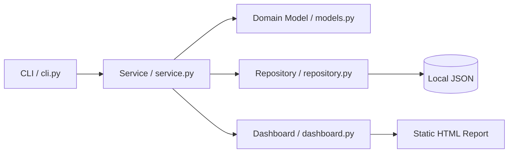

# ProjectControl Portfolio

[](https://github.com/monaka-77/project-control-portfolio/actions/workflows/ci.yml)

[▶ 静的デモを見る（GitHub Pages）](https://monaka-77.github.io/project-control-portfolio/)

複数プロジェクトのタスクを、ローカル環境で安全に一元管理するための Python 製CLIツールです。

> このリポジトリは就職活動向けの公開版です。実運用のタスク、クライアント情報、個人パス、認証情報、バックアップは含めていません。サンプルデータはすべて架空です。
>
> GitHub Pagesで公開する画面は、架空データから生成した**静的デモ**です。現時点ではブラウザからタスクを追加・編集・設定する製品版Webアプリではありません。

## 採用担当者・レビュー担当者の方へ

3分程度で確認いただく場合は、次の順番がおすすめです。

1. **[静的デモ](https://monaka-77.github.io/project-control-portfolio/)**：画面イメージと可視化の確認
2. **このREADME**：目的、設計方針、公開範囲
3. **[service.py](src/project_control/service.py)**：ユースケースと業務ロジック
4. **[repository.py](src/project_control/repository.py)**：JSON永続化と安全なファイル更新
5. **[models.py](src/project_control/models.py)**：入力値・状態の検証
6. **[tests/](tests/)**：正常系だけでなく異常系・境界条件・副作用も含むテスト
7. **[GitHub Actions](https://github.com/monaka-77/project-control-portfolio/actions/workflows/ci.yml)**：Python 3.13で構文検査とユニットテストを自動実行

### 現在の検証状況

- GitHub Actions CI：**成功**
- ユニットテスト：**135件成功**
- Python：**3.13**
- 外部ランタイム依存：**なし（Python標準ライブラリのみ）**
- 公開データ：**すべて架空のサンプル**

このポートフォリオでは、機能数そのものよりも、**安全な更新、責務分離、入力検証、再現可能なテスト、実データを公開しない運用設計**を重視しています。

## アーキテクチャ概要



CLI、業務ロジック、ドメインモデル、永続化、表示処理を分離し、変更の影響範囲を小さくしながらテストしやすい構成にしています。

## レビュー時に見ていただきたいポイント

- **安全な永続化**：JSONを直接上書きせず、一時ファイルへの書き込み後に置換
- **データ破損の回避**：不正JSON、重複ID、無効な状態・優先度などを検証してから保存
- **出力先の制限**：意図しない絶対パスやリポジトリ外への出力を拒否
- **副作用を抑えたテスト**：一時ディレクトリを利用し、本番相当データを変更しない
- **CIによる再現性**：push／pull requestごとに構文検査と全ユニットテストを自動実行
- **公開版の分離**：実運用版と公開ポートフォリオを分け、機密・個人・顧客データを含めない

## このプロジェクトで示したこと

業務で使うタスク管理を想定し、単に登録・一覧表示するだけでなく、**誤操作を避けながら状況を把握しやすい設計**を目指しました。

- データを外部サービスに依存しないローカルファースト設計
- JSON更新時の一時ファイル＋置換による安全なファイル操作
- タスクの状態・優先度・日付・出力先パスの入力検証
- CLI／設定／ドメインモデル／リポジトリ／サービス／表示処理の責務分離
- 一時ディレクトリを用いた副作用のないユニットテスト
- HTMLダッシュボード、JSONバックアップ、CSVエクスポート

## 主な機能

| 分類 | 内容 |
|---|---|
| タスク管理 | 追加、詳細表示、更新、ステータス変更、完了、アーカイブ |
| 絞り込み | プロジェクト、ステータス、優先度、タグ、期限切れ、期限間近、完了状態 |
| 可視化 | プロジェクト別進捗、ターミナルダッシュボード、静的HTMLダッシュボード |
| データ保護 | 入力検証、アーカイブ確認、JSONバックアップ、リポジトリ外への出力防止 |
| 出力 | UTF-8 BOM付きCSV、ブラウザで閲覧できる単一HTMLレポート |

## 技術構成

- Python 3.13+
- Python標準ライブラリのみ
- JSON
- `unittest`
- GitHub Actions（構文検査・ユニットテスト）

外部パッケージや外部APIに依存しないため、ローカル環境で再現しやすい構成です。

## ディレクトリ構成

```text
.
├─ config/                  # アプリケーション設定
├─ data/                    # 実行時データ（Git管理対象外）
├─ examples/                # 架空のサンプルタスク
├─ src/project_control/     # アプリケーション本体
└─ tests/                   # ユニットテスト
```

## 実行方法

PowerShellでリポジトリ直下を開き、以下を実行します。

```powershell
$env:PYTHONPATH = "$PWD\src"

python -m project_control config
python -m project_control list
python -m project_control dashboard
python -m project_control dashboard-html --open
```

サンプルデータを使う場合は、先にコピーします。

```powershell
Copy-Item examples\sample_tasks.json data\tasks.json
```

## 公開デモ

架空のサンプルタスクから生成した、ブラウザで開ける[静的HTMLダッシュボード](docs/demo-dashboard.html)を公開しています。フィルタリング、プロジェクト別進捗、期限状態、簡易ガント表示を確認できます。

**GitHub Pages：** https://monaka-77.github.io/project-control-portfolio/

> GitHub Pagesは採用・レビュー向けの静的表示です。ProjectControl本体のデータを編集したり、設定を変更したりするWebアプリではありません。ブラウザから操作できる製品UIは今後の別フェーズで実装予定です。

## テスト

```powershell
$env:PYTHONPATH = "$PWD\src"

py -3.13 -m compileall src tests
py -3.13 -m unittest discover -s tests -v
```

テストは一時ディレクトリで実行されるため、実運用の `data/tasks.json`、バックアップ、CSV出力を変更しません。

### CIで確認している内容

GitHub Actionsでは、`main`へのpushとpull requestを対象に次を自動実行します。

1. `src` と `tests` の構文コンパイル
2. `unittest` による全テスト実行
3. テスト失敗時はCIを失敗として表示

直近の公開版では **135件のテストがすべて成功**しています。

## 公開範囲について

本番運用版とはリポジトリを分離し、以下のみを公開しています。

- 汎用化したアプリケーションコード
- テストコード
- 設定例
- 架空のサンプルデータ
- 就職活動向けの説明資料

これにより、実務での設計・実装・検証の考え方を示しつつ、実データや業務情報は非公開に保っています。
